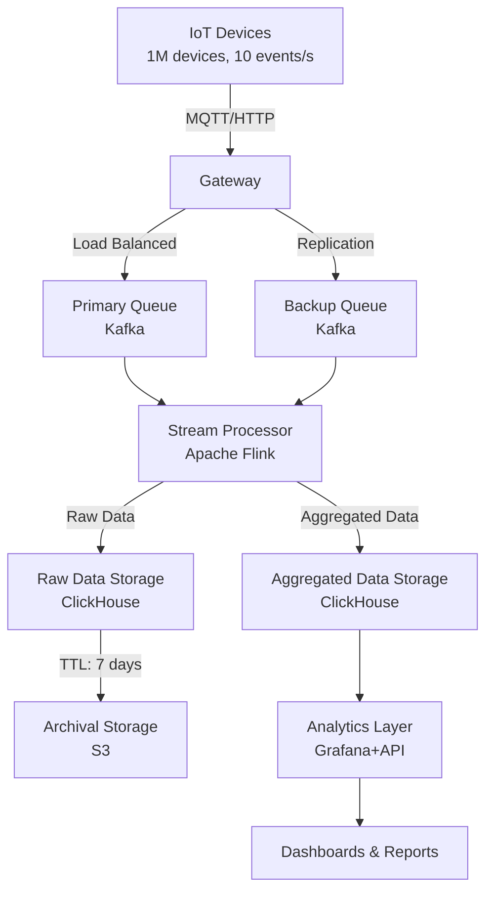

### 1. Расчет нагрузки

- **Количество устройств**: 1 млн.
- **Событий в секунду с устройства**: 10.
- **Общий поток событий**: 1,000,000 × 10 = 10,000,000 событий/с.
- **Размер события**: Предположим, каждое событие ~1 КБ (JSON с метаданными, метриками, временной меткой).
- **Общий объем данных**: 10 млн событий/с × 1 КБ = ~10 ГБ/с.
- **Суточный объем**: 10 ГБ/с × 86,400 с = ~864 ТБ/день (сырые данные).

### 2. Архитектура системы

Система состоит из следующих компонентов:

1. **IoT-устройства**: Отправляют события через MQTT или HTTP.
2. **Gateway**: Принимают данные от устройств, выполняют предварительную валидацию.
3. **Message Queue**: Буферизируют события для обработки.
4. **Stream Processor)**: Обрабатывают, агрегируют и батчат данные.
5. **Raw Data Storage**: Временное хранение событий.
6. **Aggregated Data Storage**: Долгосрочное хранение аналитики.
7. **Analytics Layer**: Предоставляет доступ к данным через API/дашборды.

### Схема потоков данных



#### 1. IoT-устройства → Шлюзы (EMQX)

- **Процесс**: Устройства отправляют события по MQTT/HTTP к EMQX. Шлюз выполняет аутентификацию, валидацию и сжатие.
- **Задержка**:
    - Сетевая задержка (устройство → шлюз): ~10 мс (зависит от географии, предполагаем оптимизированную сеть с edge-шлюзами).
    - Обработка в EMQX: ~1 мс (EMQX обрабатывает миллионы сообщений/с с субмиллисекундной задержкой при кластеризации).
- **Итог**: 10 мс + 1 мс = **11 мс**.

#### 2. Шлюзы → Очереди (Kafka)

- **Процесс**: EMQX отправляет события в Kafka. Kafka принимает сообщения и записывает их в партиции.
- **Задержка**:
    - Сетевая задержка (EMQX → Kafka): ~0.1 мс (внутри ДЦ).
    - Запись в Kafka: ~1 мс (Kafka с оптимизированными настройками, например, acks=1 для минимизации задержки).
- **Итог**: 0.1 мс + 1 мс = **1.1 мс**.

#### 3. Очереди → Обработчики (Flink)

- **Процесс**: Flink читает события из Kafka, выполняет батчинг (1000 событий или 100 мс окно), агрегацию и подготовку данных для записи.
- **Задержка**:
    - Чтение из Kafka: ~0.5 мс (Flink потребляет данные с минимальной задержкой).
    - Батчинг: ~100 мс (ожидание окна для пакетирования - основная составляющая задержки).
    - Обработка в Flink: ~2 мс (агрегация, сжатие, преобразование данных).
- **Итог**: 0.5 мс + 100 мс + 2 мс = **102.5 мс**.

#### 4. Обработчики → Хранилище сырых данных (ClickHouse)

- **Процесс**: Flink отправляет батчи событий в ClickHouse для записи в таблицу raw_metrics.
- **Задержка**:
    - Сетевая задержка (Flink → ClickHouse): ~0.1 мс.
    - Запись в ClickHouse: ~5 мс (ClickHouse обрабатывает миллионы вставок/с, батчи оптимизируют вставку).
- **Итог**: 0.1 мс + 5 мс = **5.1 мс**.

#### 5. Хранилище сырых данных → Агрегированные данные (ClickHouse Materialized View)

- **Процесс**: Materialized View в ClickHouse автоматически агрегирует сырые данные в таблицу aggregated_metrics.
- **Задержка**:
    - Обработка в Materialized View: ~10 мс
- **Итог**: **10 мс**.

#### 6. Агрегированные данные → Аналитический слой (Grafana/API)

- **Процесс**: Grafana запрашивает данные из aggregated_metrics через ClickHouse. API кэширует запросы в Redis.
- **Задержка**:
    - Запрос к ClickHouse: ~10 мс
    - Обработка в API: ~2 мс
    - Передача в Grafana: ~1 мс
- **Итог**: 10 мс + 2 мс + 1 мс = **13 мс**.
### 4. Выбор технологий

#### 4.1. Шлюзы (Gateway)

- **Технология**: EMQX (масштабируемый MQTT-брокер).
- **Обоснование**: Поддерживает миллионы подключений, кластеризацию, балансировку нагрузки.
- **Резервирование**: Развертывание кластера EMQX с репликацией в нескольких зонах доступности (AZ). Использование DNS-балансировки для устройств.
- **Функции**: Валидация данных, аутентификация устройств, сжатие (например, gzip).

#### 4.2. Очереди (Message Queue)

- **Технология**: Apache Kafka.
- **Обоснование**: Высокая пропускная способность (миллионы сообщений/с), горизонтальное масштабирование, поддержка партиционирования.
- **Резервирование**:
    - Развертывание Kafka в кластере с 3+ брокерами.
    - Репликация данных (replication factor = 3).
    - Вторичная очередь (отдельный Kafka-кластер) для обработки сбоев основного кластера.
- **Конфигурация**: Партиции по device_id для равномерного распределения нагрузки. Retention period = 1 час (буфер для обработки).

#### 4.3. Обработчики (Stream Processor)

- **Технология**: Apache Flink.
- **Обоснование**: Поддержка потоковой обработки больших объемов данных, exactly-once семантика, интеграция с Kafka.
- **Функции**:
    - Батчинг событий (например, 1000 событий/пакет).
    - Агрегация (например, среднее, мин/макс за 1 мин).
    - Сжатие данных перед записью в хранилище.
- **Резервирование**: Развертывание Flink в кластере с checkpointing на S3 для восстановления состояния.

#### 4.4. Хранилище сырых данных (Raw Data Storage)

- **Технология**: ClickHouse.
- **Обоснование**: Высокая скорость вставки (миллионы строк/с), сжатие данных, поддержка TTL.
- **TTL**: 7 дней (достаточно для оперативного анализа и отладки).
- **Резервирование**: Кластер ClickHouse с репликацией (Zookeeper для координации).

#### 4.5. Хранилище агрегированных данных

- **Технология**: ClickHouse.
- **Обоснование**: Эффективное хранение агрегированных метрик (например, по часам/дням).
- **TTL**: 1 год (для долгосрочной аналитики).
- **Резервирование**: Репликация данных, регулярный бэкап в S3.

#### 4.6. Архивное хранилище

- **Технология**: S3.
- **Обоснование**: Дешевое хранение исторических данных в сжатом формате.
- **Процесс**: Сырые данные старше 7 дней архивируются в S3 с помощью ClickHouse export.

#### 4.7. Аналитический слой

- **Технология**: Grafana + REST API.
- **Обоснование**:
    - Grafana для визуализации метрик (дашборды).
    - API для предоставления агрегированных данных внешним системам.
- **Резервирование**: Кластер Grafana с балансировкой.

### 5. Структура таблиц

#### 5.1. Таблица сырых данных (ClickHouse)

```sql
CREATE TABLE raw_metrics (
    device_id String,
    timestamp DateTime,
    metric_name String,
    metric_value Float64,
    metadata String
)
ENGINE = MergeTree()
PARTITION BY toYYYYMMDD(timestamp)
ORDER BY (device_id, timestamp)
TTL timestamp + INTERVAL 7 DAY
SETTINGS index_granularity = 8192;
```

- **TTL**: 7 дней для сырых данных.
- **Партиционирование**: По дате для эффективного удаления старых данных.
- **Оптимизация**: index_granularity для высокой скорости вставки.

#### 5.2. Таблица агрегированных данных (ClickHouse)

```sql
CREATE TABLE aggregated_metrics (
    device_id String,
    time_bucket DateTime,
    metric_name String,
    avg_value Float64,
    min_value Float64,
    max_value Float64,
    count UInt64
)
ENGINE = MergeTree()
PARTITION BY toYYYYMM(time_bucket)
ORDER BY (device_id, time_bucket, metric_name)
TTL time_bucket + INTERVAL 1 YEAR
SETTINGS index_granularity = 8192;
```

- **TTL**: 1 год для аналитики.
- **Партиционирование**: По месяцу для долгосрочного хранения.

#### 5.3. Представление для аналитики

```sql
CREATE MATERIALIZED VIEW analytics_view
ENGINE = MergeTree()
PARTITION BY toYYYYMM(time_bucket)
ORDER BY (device_id, time_bucket, metric_name)
AS
SELECT
    device_id,
    toStartOfMinute(timestamp) AS time_bucket,
    metric_name,
    avg(metric_value) AS avg_value,
    min(metric_value) AS min_value,
    max(metric_value) AS max_value,
    count() AS count
FROM raw_metrics
GROUP BY device_id, time_bucket, metric_name;
```

- **Назначение**: Автоматическая агрегация сырых данных в реальном времени.
- **Хранение**: та же схему, что и aggregated_metrics.

### 6. Оптимизация хранения

- **Сжатие**: Использование кодека LZ4 в ClickHouse для сырых и агрегированных данных.
- **Батчинг**: Обработчики (Flink) собирают события в пакеты (1000 событий) перед записью.
- **Архивирование**: Сырые данные старше 7 дней экспортируются в S3 в формате Parquet (сжатие Snappy).
- **Ожидаемый объем**:
    - Сырые данные (7 дней): ~864 ТБ/день × 7 × 0.1 (сжатие) = ~6 ПБ.
    - Агрегированные данные (1 год): ~10 ГБ/мин × 60 × 24 × 365 × 0.1 = ~500 ТБ.

### 7. Резервирование

- **Шлюзы**: Кластер EMQX с репликацией в 3 AZ.
- **Очереди**: Kafka с replication factor = 3, вторичный кластер для отказоустойчивости.
- **Обработчики**: Flink с checkpointing на S3, автоматическое масштабирование.
- **Хранилище**: ClickHouse с репликацией, бэкапы в S3.
- **Аналитика**: Grafana с кластеризацией, кэширование в Redis.

