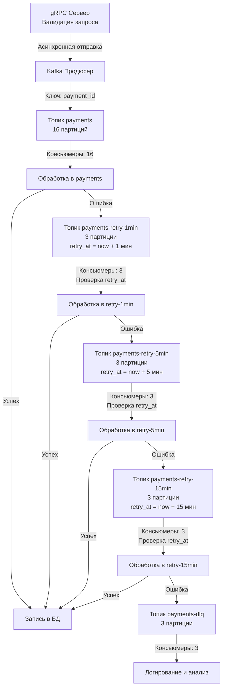

## Проектирование микросервиса обработки платежей

### Условия задачи

- **Входящий поток запросов**:
    - Средний: 5000 запросов/с.
    - Максимальный: 8000 запросов/с.
    - Минимальный: 2000 запросов/с.
- **Размер сообщения**: 2 КБ (JSON).
- **Требования**:
    - Обработка gRPC-запроса до начала обработки: ≤ 1 с в happy-кейсе.
    - Хранение данных в Kafka: 30 дней.
    - Повторная обработка ошибок: через 1, 5, 15 минут.
    - Неработающие сообщения: в Dead Letter Queue (DLQ).
    - Эффективность и минимальное использование ресурсов.

---

## Архитектура системы

### Основные компоненты

1. **gRPC-сервер**: принимает запросы и отправляет события в Kafka.
2. **Kafka-продюсер**: записывает сообщения в топик payments.
3. **Kafka-консьюмеры**: обрабатывают сообщения из топиков:
    - Основной топик: payments.
    - Retry-топики: payments-retry-1min, payments-retry-5min, payments-retry-15min.
    - DLQ: payments-dlq.
4. **База данных/кэш**: для обеспечения идемпотентности (например, Redis или PostgreSQL).

### Принципы работы

- **Event Sourcing**: каждое событие фиксируется в Kafka как отдельное сообщение.
- **Exactly Once**: идемпотентность на уровне приложения с использованием уникального payment_id.
- **Отказоустойчивость**: репликация данных в Kafka с replication.factor=3.

---

## Расчёты

### Объём данных

- Для максимальной нагрузки (10 000 сообщений/с с запасом):
    - 10 000 × 2 КБ × 60 с × 60 мин × 24 ч ≈ **1.7 ТБ/день**.
    - За 30 дней: 1.7 ТБ × 30 ≈ **51 ТБ** (сжатие Snappy уменьшит объём на ~30–50%).

### Пропускная способность и партиции

- Пропускная способность одной партиции Kafka: ~500–1000 сообщений/с.
- Для 10 000 сообщений/с:
    - Минимально: 10 000 / 1000 = **10 партиций**.
    - С запасом: **16 партиций** (для масштабируемости и равномерной нагрузки).

### Размер батчей (при linger.ms=5)

- Средний: 5000 × 0.005 × 2 КБ = **50 КБ**.
- Максимальный: 8000 × 0.005 × 2 КБ = **80 КБ**.
- Минимальный: 2000 × 0.005 × 2 КБ = **20 КБ**.

## Настройки Kafka

### Топики

| Топик                | Партиции | Ретеншен | Репликация | Сжатие |
| -------------------- | -------- | -------- | ---------- | ------ |
| payments             | 16       | 30 дней  | 3          | Snappy |
| payments-retry-1min  | 3        | 30 дней  | 3          | Snappy |
| payments-retry-5min  | 3        | 30 дней  | 3          | Snappy |
| payments-retry-15min | 3        | 30 дней  | 3          | Snappy |
| payments-dlq         | 3        | 30 дней  | 3          | Snappy |

- **Ретеншен**: retention.ms=2592000000 (30 дней).
- **Репликация**: replication.factor=3 (отказоустойчивость).
- **Минимальная синхронизация**: min.insync.replicas=2 (гарантия записи).

### Продюсер

- **Сжатие**: compression.type=snappy (экономия трафика и скорости).
- **Батчинг**:
    - linger.ms=5 (минимизация задержки gRPC).
    - batch.size=1600000 (1.6 МБ, для пиковой нагрузки).
- **Надёжность**:
    - acks=all (запись на все реплики).
    - retries=3 (повторы при сбоях).
- **Асинхронность**: отправка с callback’ом для минимизации времени ответа gRPC.

### Консьюмеры

1. **Топик payments**:
    - Группа: payments-group.
    - Количество: **16** (по одному на партицию).
    - enable.auto.commit=false (ручной коммит после обработки).
    - max.poll.records=100 (батчевая обработка).
    - fetch.min.bytes=50000 (50 КБ), fetch.max.wait.ms=100 (баланс задержки и нагрузки).
2. **Retry-топики**:
    - Группы: retry-1-group, retry-5-group, retry-15-group.
    - Количество: **3** на группу.
    - Логика: проверка поля retry_at для задержки обработки.
3. **DLQ**:
    - Группа: dlq-group.
    - Количество: **3**.
    - Действие: логирование и алертинг.

## Структура сообщения

- Формат: JSON.
- Пример:
```json
{
  "payment_id": "uuid-1234-5678",
  "amount": 100.50,
  "currency": "USD",
  "timestamp": "2025-04-08T12:00:00Z",
  "retry_at": "2025-04-08T12:01:00Z"  // для retry-топиков
}
```
**Ключ**: payment_id.

- Обеспечивает попадание сообщений с одним payment_id в одну партицию.
- Упрощает идемпотентность и порядок обработки.

---
## Обработка сообщений

### Блок-схема



### Алгоритм обработки

1. **gRPC-запрос**:
    - Валидация данных.
    - Асинхронная отправка в payments через продюсер (ответ клиенту сразу после передачи).
2. **Обработка в payments**:
    - Успех: запись в БД, коммит.
    - Ошибка: отправка в payments-retry-1min с retry_at = now + 1 мин.
3. **Retry-топики**:
    - Консьюмер проверяет retry_at:
        - Если время не наступило: пропуск.
        - Если наступило: обработка.
    - Успех: запись в БД.
    - Ошибка: переход в следующий retry-топик или DLQ (после 15 мин).
4. **DLQ**: логирование и уведомление для анализа.

## Пояснения к настройкам

### Почему 16 партиций для payments?

- Обеспечивает обработку 8000–10 000 сообщений/с с запасом.
- Позволяет масштабировать консьюмеры до 16 при росте нагрузки.

### Почему linger.ms=5?

- Минимизирует задержку gRPC (5 мс << 1 с).
- Достаточно для формирования батчей (20–80 КБ).

### Почему ключ payment_id?

- Гарантирует порядок обработки для одной транзакции.
- Упрощает идемпотентность (проверка по payment_id в кэше/БД).

### Retry-механизм

- Поле retry_at позволяет реализовать задержку без внешних шедулеров.
- Альтернатива: Kafka Streams с окнами времени или внешний таймер.

---
## Итог

- Время обработки в happy-кейсе: ≤ 1 с (gRPC-ответ за ~5 мс + обработка).
- Повторная обработка: через 1, 5, 15 минут.
- Хранение: 30 дней.
- Отказоустойчивость: replication.factor=3.
- Эффективность: сжатие Snappy, оптимальные батчи.