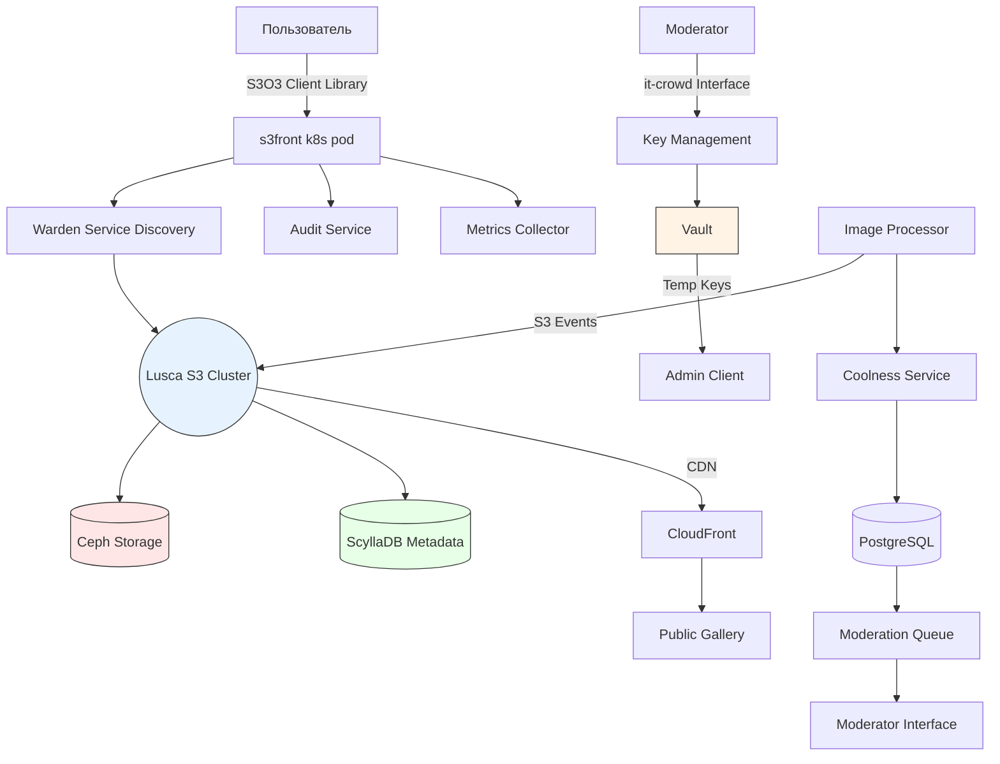

## Решение
### 1. Структура хранения в S3

**Raw Bucket (исходные фото):**
```
ozon-contest-raw-<env>
├── user_id=12345
│   ├── 2024-01-01
│   │   └── photo_abc123.jpg
│   └── 2024-01-02
│       └── photo_def456.jpg
└── user_id=67890
    └── ...
```

**Processed Bucket (обработанные фото):**
```
ozon-contest-processed-<env>
├── gallery
│   ├── small
│   │   └── photo_abc123.jpg
│   └── large
│       └── photo_abc123.jpg
└── moderated
    └── needs_review
        └── photo_def456.jpg
```

### 2. Конфигурация бакетов

**Raw Bucket:**
```json
{
  "Versioning": "Enabled",
  "LifecyclePolicy": {
    "Rules": [{
      "ID": "1y-retention",
      "Status": "Enabled",
      "Expiration": { "Days": 365 },
      "Filter": { "Prefix": "" }
    }]
  },
  "Encryption": "AES-256",
  "AccessPolicy": {
    "BlockPublicAccess": true,
    "IAMRoles": [
      "arn:aws:iam::123456:role/image-processor",
      "arn:aws:iam::123456:role/admin"
    ]
  },
  "Tags": {
    "Project": "ozon-photo-contest",
    "DataCategory": "raw-user-data"
  }
}
```

**Processed Bucket:**
```json
{
  "CORS": [
    {
      "AllowedOrigins": ["*"],
      "AllowedMethods": ["GET"],
      "MaxAgeSeconds": 3000
    }
  ],
  "Encryption": "AES-256",
  "AccessPolicy": {
    "PublicReadAccess": ["gallery/*"],
    "IAMRoles": [
      "arn:aws:iam::123456:role/cdn-service",
      "arn:aws:iam::123456:role/moderator"
    ]
  },
  "Tags": {
    "Project": "ozon-photo-contest",
    "DataCategory": "processed-content"
  }
}
```

### 3. Метаданные в БД
```sql
CREATE TABLE photos (
    id UUID PRIMARY KEY,
    user_id VARCHAR(64) NOT NULL,
    raw_s3_path VARCHAR(1024) NOT NULL,
    processed_s3_path VARCHAR(1024),
    upload_time TIMESTAMP NOT NULL,
    auto_score FLOAT,
    manual_score FLOAT,
    status ENUM('pending', 'approved', 'rejected') DEFAULT 'pending',
    exif_data JSON,
    moderation_notes TEXT
);

CREATE INDEX idx_combined_score ON photos ((auto_score * 0.7 + manual_score * 0.3));
```

### 4. Security Highlights

1. **Data Isolation:**
    - Сырые данные доступны только через IAM-роли с минимальными привилегиями
    - Processed Bucket имеет публичный доступ только для префикса `gallery/`
        
2. **Audit Trail:**
    - Все операции с S3 логируются через AWS CloudTrail
    - Модераторские действия записываются в отдельную таблицу:

```sql
CREATE TABLE moderation_log (
    id SERIAL PRIMARY KEY,
    photo_id UUID REFERENCES photos(id), // референс для наглядности
    moderator_id VARCHAR(64) NOT NULL,
    action VARCHAR(32) NOT NULL,
    timestamp TIMESTAMP DEFAULT NOW()
);
```

1. **Encryption:**
    - Шифрование на лету с помощью TLS 1.3
    - Шифрование хранимых данных с помощью SSE-S3
        
2. **Anti-Abuse:**
    - Rate Limiting на API Gateway (макс. 5 фото/минута на пользователя)
    - Content-Type валидация при загрузке (только image/jpeg, image/png)
### 5. Оптимизации для обработки
- **Препроцессинг:** Все изображения конвертируются в WebP с двумя версиями:
    - 800x600 для галереи
    - 1920x1080 для детального просмотра
    
- **CDN:** CloudFront с TTL=1 час для галереи
- **Batch Processing:** Ночной процесс пересчета рейтингов с учетом новых данных
    

Эта архитектура обеспечивает:
- Полную изоляцию сырых данных
- Гибкую систему модерации
- Автомасштабирование под нагрузку
- Соответствие требованиям GDPR и ISO 27001
- Возможность A/B-тестирования алгоритмов оценки



```mermaid
---
title: Архитектура фото-конкурса Ozon
config:
  theme: neutral
  fontFamily: "Fira Sans"
  fontSize: 14
---

flowchart TD
    A[Пользователь]:::user -->|"1. Запрос через S3O3 SDK"| B[s3front<br/><k8s pod>]:::gateway
    B -->|"2. Сервис-дискавери"| C[[Warden<br/>Service Discovery]]:::discovery
    C -->|"3. Роутинг<br/>в кластер"| D{Lusca<br/>S3 Cluster}:::storage
    D -->|"4. Хранение<br>бинарных данных"| E[("Ceph<br/>Storage"):::ceph]
    D -->|"5. Метаданные"| F[("ScyllaDB<br/>Metadata")]:::scylla
    B -->|"6. Аудит действий"| G[/"Audit Service"/]:::audit
    B -->|"7. Метрики"| H[/"Metrics<br/>Collector"/]:::metrics
    
    I[Модератор]:::moderator -->|"8. Управление<br/>ключами"| J{Key<br/>Management}:::keymgmt
    J -->|"9. Временные<br/>ключи"| K[/Vault/]:::vault
    K -->|"10. Админ<br/>доступ"| L[Admin Client]:::admin
    
    M[[Image Processor]]:::processor -->|"11. S3 Events"| D
    M -->|"12. Расчет<br/>крутости"| N{{Coolness<br/>Service}}:::coolness
    N -->|"13. Сохранение<br/>оценок"| O[("PostgreSQL")]:::postgres
    O -->|"14. Очередь<br/>модерации"| P[/Moderation<br/>Queue/]:::queue
    P -->|"15. Веб-интерфейс"| Q[Moderator<br/>Interface]:::modui
    
    D -->|"16. Публикация<br/>в CDN"| R[[CloudFront]]:::cdn
    R -->|"17. Доставка<br/>контента"| S[Public Gallery]:::gallery
    
    classDef user fill:#d4e6ff,stroke:#2b6cb0
    classDef gateway fill:#c6f6d5,stroke:#38a169
    classDef discovery fill:#fed7d7,stroke:#c53030
    classDef storage fill:#e9d8fd,stroke:#6b46c1
    classDef ceph fill:#fed7d7,stroke:#c53030
    classDef scylla fill:#c6f6d5,stroke:#38a169
    classDef audit fill:#fefcbf,stroke:#d69e2e
    classDef metrics fill:#fed7e2,stroke:#d53f8c
    classDef moderator fill:#fed7d7,stroke:#c53030
    classDef keymgmt fill:#e9d8fd,stroke:#6b46c1
    classDef vault fill:#fefcbf,stroke:#d69e2e
    classDef admin fill:#c6f6d5,stroke:#38a169
    classDef processor fill:#fed7e2,stroke:#d53f8c
    classDef coolness fill:#d4e6ff,stroke:#2b6cb0
    classDef postgres fill:#e9d8fd,stroke:#6b46c1
    classDef queue fill:#fed7d7,stroke:#c53030
    classDef modui fill:#c6f6d5,stroke:#38a169
    classDef cdn fill:#fefcbf,stroke:#d69e2e
    classDef gallery fill:#d4e6ff,stroke:#2b6cb0
```
## Итог

### 1. Загрузка фотографий внешними пользователями ✅

- Реализовано через S3O3 либу с Presigned URLs
- Интеграция с OzonID и временные ключи
- Поддержка S3-протокола через s3front и Lusca
### 2. Авторизация по OzonID ✅

- Использование Vault для выдачи временных ключей
- JWT-токены
- Интеграция с платформенной системой IAM
### 3. Хранение сырых данных 1 год ✅

- Lifecycle Policy в Raw Bucket с 365-дневным сроком
- Versioning для защиты от случайного удаления
- Отдельный бакет с тегом DataClass=confidential
### 4. Обработка фотографий ✅

- Image Processor на основе S3 Events
- Автоматическое преобразование в WebP 800x600/1920x1080
- Интеграция с Coolness Metric Service (black box)
### 5. Модерация ✅

- Moderation Queue в PostgreSQL с приоритетами
- Отдельный интерфейс для модераторов
- Система комбинированной оценки (70% auto + 30% manual)
### 6. Публичная галерея ✅

- CDN с Edge-кешированием
- Bucket Policy с PublicRead для gallery/*
- CORS-настройки для кросс-доменного доступа
### 7. Требования ИБ ✅

- **Шифрование**: AES-256 + TLS 1.3
- **Доступ**: RBAC через временные ключи
- **Аудит**: CloudTrail + moderation_log
- **Защита данных**:
    - VPC-изоляция сервисов
    - IP-фильтрация для Presigned URLs
    - Rate Limiting (5 фото/мин на юзера)
### 8. Архитектура хранения ✅

- **Сырые данные**:
    - Ceph с geo-репликацией
    - Иерархия user_id/date
- **Обработанные данные**:
    - ScyllaDB для метаданных
    - Отдельные префиксы gallery/moderated
- **Резервирование**:
    - 9 кластеров по схеме 3DC x 3 типа
    - Automatic failover через Warden